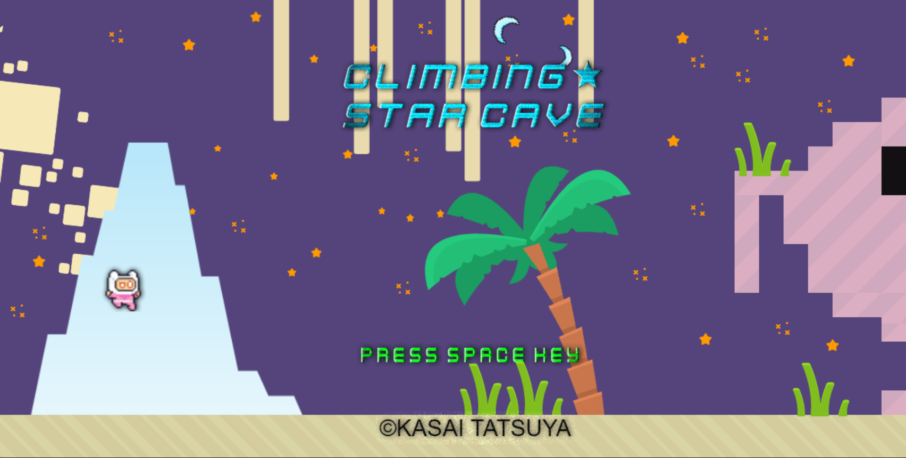

# Portfolio

- 葛西　達也
- 連絡先 Gmail:tatsu32fuwa@gmail.com
- 専門学校デジタルアーツ東京 ゲームプログラムコース 2024年卒業予定

## 資格
- 

## スキル
- C#
  - 利用歴1年
  - Visual Studioで独自のツールの作成が可能
- Unity
  - 利用歴1年
  - オリジナルの個人/チーム作品の開発経験あり
- C/C++
  - 利用歴1年
  - コンソールで簡単なデータ処理プログラムを開発
- GDevelop
  - 利用歴半年
  - ゲームの作成

## 取り組んでいるテーマ
1. オリジナルゲーム開発

## 作品リスト
CLIMING STAR CAVE

[CLIMING STAR CAVE](https://liluo.io/kuzu/climing-star-cave)

壁を登ってお宝を探すアクションゲーム

- 開発環境：GDevelop
- 開発期間：一ヶ月

## 連絡先
- Gmail:tatsu32fuwa@gmail.com

