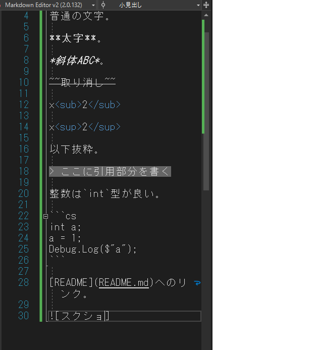

# 大見出し
## 中見出し
### 小見出し
普通の文字。

**太字**。

*斜体ABC*。

~~取り消し~~

x<sub>2</sub>

x<sup>2</sup>

以下抜粋。

> ここに引用部分を書く

整数は`int`型が良い。

```cs
int a;
a = 1;
Debug.Log($"a");
```

[README](README.md)へのリンク。



- 箇条書き
  - みりん
    - 醤油
- ｈｈｈｈｈｈｈｈｈｈｈｈｈｈｈｈｈｈｈｈっほおおおおおおおおおおおおおおおおおおおおお

1. 順番1
   1. 順番2
      1. 順番3

- [ ] 作業
- [x] 2
- [ ] 3

|No|氏名|フリガナ|
|-:|:-:|:-|
|1|葛西|カサイ|
|2|gogog|ゴゴグ|